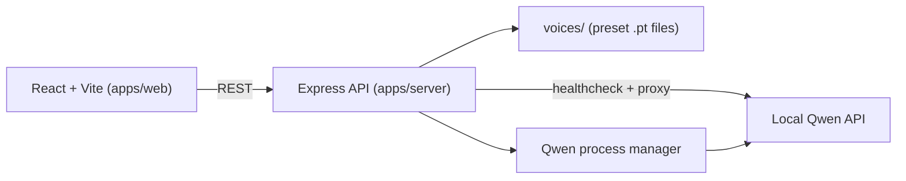

# VoiceStudio

<p align="center">
  <strong>Local voice cloning + text-to-speech studio powered by Qwen</strong><br/>
  React UI + Express proxy + local runtime orchestration.
</p>

<p align="center">
  
  
  
  
  
</p>

---

## Quick Overview

- Modern UI to split text into paragraphs and process them in queue mode.
- Playback timeline and final audio export.
- Voice preset library (create, rename, delete).
- Backend with Qwen health checks and auto-start orchestration.
- Local-first workflow (Qwen runs on your machine, not in the cloud).

## Platform Notice

VoiceStudio has only been tested on **Windows** so far.
If you run it on Linux or macOS, feel free to share results by opening an issue or contributing improvements.

See contribution guidelines: [CONTRIBUTING.md](./CONTRIBUTING.md)

## Visual Demo

> Recommended: add your own screenshots/GIFs/video here for a polished GitHub showcase.

### Video (walkthrough)

- Full demo: `https://your-demo-link-here`

### Screenshots


## Architecture



## Stack

| Layer | Tech | Role |
| --- | --- | --- |
| Frontend | React 19 + Vite | UI, timeline, generation queue |
| Backend | Express 5 + TypeScript | Secure proxy, validation, runtime management |
| TTS Runtime | Qwen3-TTS (local) | Voice inference and audio generation |
| Workspace | npm workspaces | Monorepo with `apps/web` + `apps/server` |

## Project Structure

```text
.
|- apps/
|  |- web/          # React + Vite frontend
|  |- server/       # Express + TypeScript backend
|- voices/          # local voice presets
|- .env.example
|- README.md
```

## Important: Qwen is NOT included

The Qwen runtime folder is intentionally excluded from Git.
You must install Qwen3-TTS separately and configure how this project launches it.

- Official repo: [Qwen3-TTS](https://github.com/QwenLM/Qwen3-TTS)

## Requirements

- Node.js `20+`
- npm `10+`
- A working local Qwen3-TTS setup

Typical Python setup example:

```bash
python -m venv .venv
.venv/bin/pip install qwen-tts
```

## Quick Start

1. Install dependencies:

```bash
npm install
```

2. Create environment file:

```bash
cp .env.example .env
```

PowerShell:

```powershell
Copy-Item .env.example .env
```

3. Start frontend + backend:

```bash
npm run dev
```

4. Open:

- Frontend: `http://127.0.0.1:5173`
- Backend: `http://127.0.0.1:8787`

## Configuration (`.env`)

Main variables:

- `QWEN_DIR`: working directory used to launch Qwen.
- `QWEN_START_CMD`: full command used to start Qwen.
- `QWEN_API_URL`: Qwen API base URL (default `http://127.0.0.1:8000`).
- `BACKEND_PORT`: backend API port (default `8787`).
- `STARTUP_TIMEOUT_MS`: max wait time for Qwen readiness.
- `HEALTHCHECK_INTERVAL_MS`: health probe interval.
- `MAX_UPLOAD_MB`: upload limit.
- `ALLOWED_AUDIO_MIME`, `ALLOWED_PROMPT_MIME`: allowed MIME types.

Example startup command:

```bash
qwen-tts-demo Qwen/Qwen3-TTS-12Hz-1.7B-Base --device cuda:0 --dtype fp16 --no-flash-attn --ip 127.0.0.1 --port 8000
```

## Auto-Startup Flow

On backend startup:

1. Check if Qwen is already reachable at `QWEN_API_URL`.
2. If reachable, reuse that running instance.
3. If not reachable, launch Qwen with `QWEN_START_CMD`.
4. Poll until Qwen is ready or timeout is reached.

Note: the server does not kill/stop your Qwen terminal on shutdown.

## Backend Endpoints

- `GET /health`
- `GET /api/qwen/status`
- `GET /api/qwen/voices`
- `POST /api/qwen/voices`
- `PATCH /api/qwen/voices/:voiceName`
- `DELETE /api/qwen/voices/:voiceName`
- `POST /api/qwen/run_voice_clone`
- `POST /api/qwen/save_prompt`
- `POST /api/qwen/load_prompt_and_gen`
- `GET /api/qwen/audio-file?url=...`

## How to Use (UI)

1. Upload or select a model/preset.
2. Paste text (it is automatically split into paragraphs).
3. Process the paragraph queue.
4. Play results in the timeline.
5. Export final audio.

## Optional README Widgets

You can add these to make the README more dynamic:

- Build/test/version badges with Shields.
- Screenshot carousel (GIF or short video).
- CTA button: `Watch Demo`.
- Roadmap/status cards.

## License

This project is licensed under the **PolyForm Noncommercial 1.0.0** license.
Commercial use is not allowed.

See: [LICENSE.md](./LICENSE.md)

## Troubleshooting

### Process button is disabled

Check that:

- A model is uploaded/selected.
- At least one paragraph exists.
- No generation job is currently running.

### Qwen readiness timeout

- Verify `QWEN_DIR` and `QWEN_START_CMD`.
- Confirm Qwen starts correctly when run manually.
- Increase `STARTUP_TIMEOUT_MS` if model boot is slow.

### Port conflicts

If the `QWEN_API_URL` port is already in use by another process, change it or free that port.
